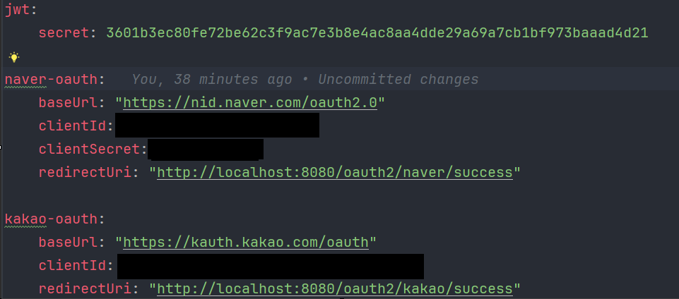

# OAuth Test

## 개요

간단한 OAuth Test 프로젝트입니다. 현재 카카오와 네이버 소셜 로그인을 지원하며 getMembers는 로그인을 통해 얻은 토큰을
Authorization 헤더에 명시해줘야 사용할 수 있습니다.

## application.yml 설정



- jwt sercret
    ```
        openssl rand -hex 64    
    ```
- naver-oauth
    - 네이버 로그인 API 명세서 (https://developers.naver.com/docs/login/api/api.md)

- kakao-oauth
    - 카카오 로그인 API
      명세서 (https://developers.kakao.com/docs/latest/ko/kakaologin/rest-api)
